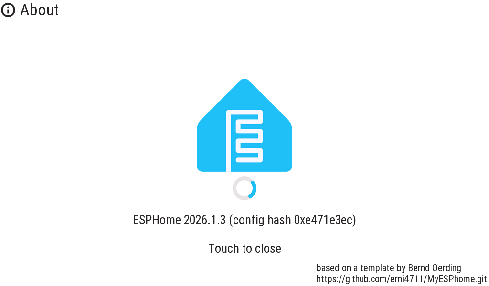
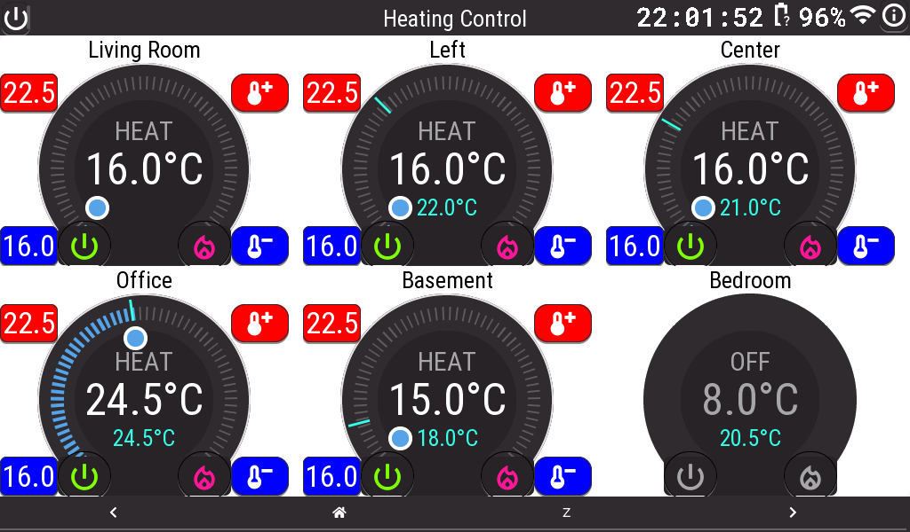
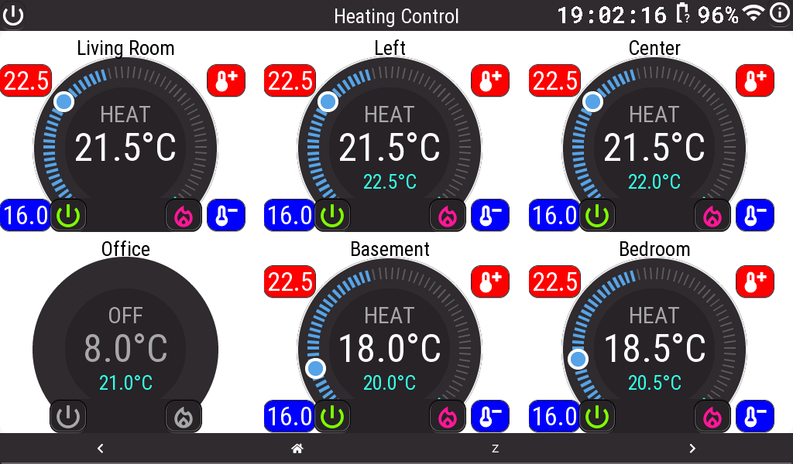

# MyESPhome — Home Assistant Panel Display

> **Breaking changes:** This project is undergoing an architectural transition.

Inspired by [HomeTiles](https://github.com/GalusPeres/HomeTiles), the ESPHome implementation now includes an `/admin` configuration API for managing the panel layout and tile definitions. The long-term goal is to replace MQTT-based communication with direct consumption of the Home Assistant REST API and WebSocket API, allowing the display to retrieve entity data and receive state updates in real time.

See [API.md](API.md) for the API documentation.

This integration is currently experimental. APIs, configuration formats, and supported features may change as development continues.

An [ESPHome](https://esphome.io/)-based touch panel display for Home Assistant, running on Waveshare ESP32 boards. Includes UI pages for climate control, voice control, and weather forecasts.

A custom [screenshot component](config/components/screenshot/README.md) lets you capture the live display via HTTP.

## Compatibility

| Component | Tested version |
|-----------|---------------|
| ESPHome   | 2026.4.0 (minimum) |
| LVGL      | 9.5 |
| esp-idf   | recommended (auto-selected by ESPHome) |

## Hardware

| Board | Sample file | Notes |
|-------|-------------|-------|
| [ESP32-S3-Touch-LCD-7](https://www.waveshare.com/wiki/ESP32-S3-Touch-LCD-7) | `config/7i-sample.yaml` | 7" 800×480, RGB |
| [ESP32-S3-Touch-LCD-7B](https://www.waveshare.com/wiki/ESP32-S3-Touch-LCD-7B) | `config/7ib-sample.yaml` | 7" 1024×600, MIPI-DSI |
| [ESP32-P4-WIFI6-Touch-LCD-7B](https://docs.waveshare.com/ESP32-P4-WIFI6-Touch-LCD-7B) | `config/P4-7B-sample.yaml` | 7" 1024×600, MIPI-DSI, Wi-Fi 6 |
| [ESP32-P4-WIFI6-Touch-LCD-10.1](https://docs.waveshare.com/ESP32-P4-WIFI6-Touch-LCD-X) | `config/P4-10-sample.yaml` | 10" 1280×800, MIPI-DSI, Wi-Fi 6 |
| | `config/P4-10-sample2.yaml` |  dito with tiles API |


## Software features
- Multi-page LVGL UI (climate control, voice control, weather forecast)
- SD card file browser served via web server (`/file/`)
- OpenWeatherMap integration — 8-day and 48-hour forecast pages
- Voice control integration (Home Assistant voice pipeline)
- HTTP screenshot endpoint (`/screenshot.png`)

---

## ESP32-S3 Sample (`7i-sample.yaml` / `7ib-sample.yaml`)

### Prerequisites
- Python 3 and pip OR Docker, or Home Assistant ESPHome add-on.
- ESPHome CLI: `pip install esphome`
- USB cable (for initial serial flashing) or network access for OTA flashing.
- Create `config/secrets.yaml` with your Wi-Fi and OTA credentials:

```yaml
wifi_ssid: "SSID"
wifi_password: "pwd"
ota_password: "ota_pwd"
ha_long_lived_access_token: "long-lived-access-token"
```

### Quick build (local CLI)
From the `config/` directory:
```bash
esphome compile 7i-sample.yaml
```

### Flashing via USB (serial)
```bash
esphome run 7i-sample.yaml
# or specify a port:
esphome run 7i-sample.yaml --device /dev/ttyUSB0
```

### Flashing via OTA
```bash
esphome run 7i-sample.yaml
```

### Using Docker
```bash
docker run --rm -v "$(pwd)/config":/config -it esphome/esphome run 7i-sample.yaml
```

### Home Assistant
Add `7i-sample.yaml` to the ESPHome add-on dashboard and use the web UI to compile and flash.

### S3 sample screenshots

#### About


#### Heating Control


#### 8-day forecast
OpenWeatherMap One Call API 3.0 — https://openweathermap.org/api#one_call_3


#### 48-hour forecast


---

## ESP32-P4 Sample (`P4-7B-sample.yaml`)

Sample configuration for the **ESP32-P4-WIFI6-Touch-LCD-7B** board. This sample demonstrates the full feature set on the P4 platform and requires **ESPHome ≥ 2026.4.0** and **LVGL 9.5**.

### Hardware specs
- SoC: ESP32-P4 @ 360 MHz, 32 MB flash
- Display: 7" 1024×600 MIPI-DSI touch screen
- Connectivity: Wi-Fi 6 (802.11ax), Bluetooth 5
- SD card slot (SDMMC)
- Camera connector (OV5647 compatible)

### Home Assistant integrations required

| Integration | Purpose |
|-------------|---------|
| `climate.*` entities | Climate control page — displays setpoint, current temperature, and HVAC mode for each room |
| OpenWeatherMap (REST) | Weather daily and hourly forecast pages |
| Voice pipeline (assist) | Voice Control page — shows spoken transcript and assistant response |
| `input_select.ui_language` | Language selection for weather labels |

### Pages

The sample exposes an **`LVGL Page`** select entity (controllable from Home Assistant) to switch between pages:

| Option | Description |
|--------|-------------|
| `Climate` | Heating/cooling control widgets for up to 6 rooms. Shows current temperature, setpoint arc, and HVAC mode per zone. |
| `Voice Control` | Voice assistant interface showing spoken transcript and assistant response via the Home Assistant voice pipeline. |
| `Weather Daily` | 8-day weather forecast from OpenWeatherMap showing daily high/low, condition icons, and precipitation. |
| `Weather Hourly` | 48-hour weather forecast showing temperature and precipitation per hour. |

### Build and flash

From the `config/` directory:
```bash
# Compile
esphome compile P4-7B-sample.yaml

# Flash via USB (Windows COM port example)
esphome run P4-7B-sample.yaml --device COM7

# Flash via OTA
esphome run P4-7B-sample.yaml
```

### P4 sample screenshots

Screenshots captured from a running device using the `/screenshot.png` HTTP endpoint.
To switch pages before capturing, use the **LVGL Page** select entity in Home Assistant.

#### Climate page


#### Voice Control page


#### Weather Daily page


#### Weather Hourly page


---

## Typical workflow notes
- Use `esphome compile` to verify configuration without flashing.
- Use `esphome logs <sample>.yaml` to watch serial logs.
- Keep backups of working firmware binaries from the `.esphome/build/` directory.
- Use `esphome dashboard config/` to open a local web UI for managing multiple YAML files.

## Troubleshooting
- **Permission errors on serial ports**: add your user to the `dialout`/`tty` group, or use `sudo` (Linux/macOS).
- **OTA upload fails**: verify device IP, OTA password, and network firewall settings.
- **Build errors**: run `esphome compile <sample>.yaml` and inspect the full output.
- **P4 board not found**: ensure ESPHome ≥ 2026.4.0 is installed (`pip install --upgrade esphome`).
